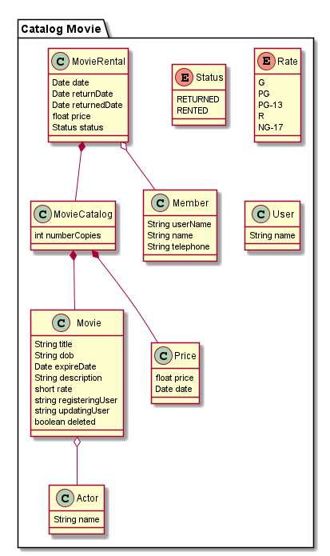

# Movie Catalog
This project is just for practice purposes

## Requirements
- Java 8 or higher.
- Maven 3.0.0 or higher
##Run
Inside the root folder, run: 
```
mvn spring-boot:run
```

##Swagger
The project has swagger ui in order to test the endpoints, 
so the url of the swagger: 
```
http://localhost:8080/swagger-ui.html
```
##H2
The database is embedded, but it has a database client and its url is:
```
http://localhost:8080/h2-console/
```
credentials:
```
user: sa
password: password
```
## Initial Model

